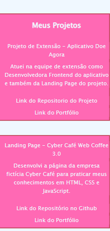
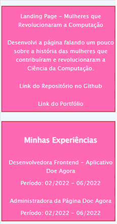
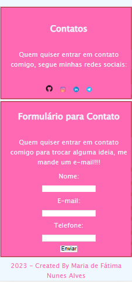

# 👩‍💻 Landing Page - Teste Técnico Desenvolvedor Frontend

Este repositório foi criado para salvar todos os arquivos associados a uma Página Web desenvolvida em HTML, CSS e JavaScript para realizar o Teste Técnico em Desenvolvimento Web.

 

<b><i>Página Inicial do Site</b></i>

 

<b><i>Meus Projetos e Experiências</b></i>

 

 

<b><i>Contatos e Formulário</b></i>

 

<b><i>📁 Meu Portfólio</b></i>

🖱 <a href="https://alvesmariadefatima.github.io/desafio-teste-tecnico-frontend-junior/">Link do Website</a>

2023 - Maria de Fátima Nunes Alves

